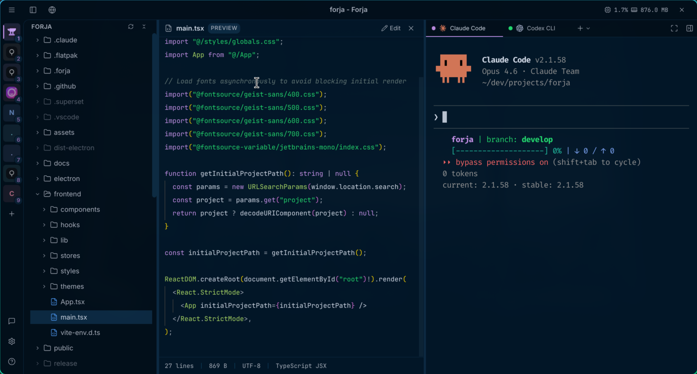

# Forja

A dedicated GUI client for Claude Code (and other AI coding CLIs), built with Electron + React. Not just another terminal: it's the forge where code is shaped with artificial intelligence.

## Screenshot



## Concept

Forja opens directly into Claude Code. The user picks a project directory and the session starts. The main experience is Claude Code with enhanced visual rendering (rich markdown, syntax-highlighted code blocks, visual diffs). Git context is always visible in the header.

## Features

- **Multi-CLI Support** - Claude Code, Gemini CLI, Codex CLI, Cursor Agent, and plain terminal sessions
- **Multi-Session Tabs** - Multiple concurrent sessions with tab management (Ctrl+T, Ctrl+W, Ctrl+Tab)
- **Project Selector** - Home screen with recent projects and filesystem browser
- **Claude Code Pane** - PTY running AI CLIs with full terminal emulation via xterm.js
- **File Tree Sidebar** - Collapsible sidebar with project directory structure, file type icons, git status indicators, and Ctrl+B toggle
- **File Preview Pane** - Syntax-highlighted code preview and markdown rendering for project files
- **Settings Editor** - In-app JSON settings editor with syntax highlighting and live validation (Ctrl+,)
- **Git Integration** - Current branch in the header, modified files counter, per-file git status badges, auto-updates via file watcher
- **Workspaces** - Group multiple projects into named workspaces that open in dedicated windows
- **Command Palette** - Quick file navigation (Ctrl+P) and command access (Ctrl+Shift+P)
- **Keyboard Shortcuts** - Comprehensive keyboard shortcuts with customizable bindings
- **Terminal Zoom** - Independent font size control for terminal (Ctrl+Alt++/-)
- **Font Settings** - Separate font configuration for 3 areas: app UI, editor/preview, and terminal
- **Window Controls** - Custom titlebar with opacity and zoom level settings
- **System Metrics** - Real-time CPU, memory, swap, disk, and network metrics in the status bar
- **Session State** - Visual indicator for "thinking" vs "ready" states
- **Error Handling** - Graceful fallback when AI CLI is not installed

## Stack

| Technology | Purpose |
|-----------|---------|
| **Electron** | Desktop framework (Node.js backend + Chromium frontend) |
| **React 19 + TypeScript** | UI framework |
| **Tailwind CSS 4 + shadcn/ui** | Styling and components |
| **xterm.js + node-pty** | Terminal emulation and PTY management |
| **Shiki** | Syntax highlighting (Catppuccin Mocha theme) |
| **react-markdown + remark-gfm** | Markdown output rendering |
| **Zustand** | State management |
| **chokidar** | File watching (.git/ changes, settings) |
| **electron-store** | Config storage (~/.config/forja/config.json) |
| **systeminformation** | System metrics (CPU, memory, disk, network) |
| **Lucide React** | Icon system |
| **Vitest + React Testing Library** | Testing framework |

## Architecture

```
[React Frontend (Chromium)]
    |
    | Electron IPC (invoke + events)
    |
[Node.js Backend (Main Process)]
    +-- PTY Manager (node-pty)
    |   +-- Spawns claude / gemini / codex / terminal processes
    |   +-- Streams output -> Frontend via IPC events
    +-- File Watcher (chokidar)
    |   +-- Monitors .git/ for changes
    |   +-- Watches settings.json for live reload
    +-- Git Reader (git CLI)
    |   +-- Branch info (git branch --show-current)
    |   +-- File status (git status --porcelain)
    +-- Config Manager (electron-store)
    |   +-- Recent projects, UI preferences
    +-- User Settings (~/.config/forja/settings.json)
    +-- System Metrics (systeminformation)
```

### App Layout

```
+---------------------------------------------------+
|  Titlebar (40px) - menu + title + window controls  |
+------+--------------------+------------------------+
|      |                    |                        |
| File |  Terminal Pane     |  File Preview /        |
| Tree |  (xterm.js)        |  Settings Editor       |
| 256px|  ~60% width        |  ~40% width            |
|      |                    |                        |
+------+--------------------+------------------------+
|  Status Bar (24px) - git info + system metrics      |
+---------------------------------------------------+
```

### Application Flow

```
Home Screen (Project Selector)
  -> User selects project directory
  -> Workspace opens
      +-- Tab Bar (multi-session management)
      +-- Terminal Pane (PTY + xterm.js)
      +-- File Tree Sidebar (directory structure + git status)
      +-- File Preview Pane (code + markdown rendering)
      +-- Status Bar (git branch + metrics)
```

## Inspirations

- **Warp** - Modern terminal UX, integrated AI
- **Raycast** - Excellent dark mode, density, polish
- **Zed** - Minimal, performance-focused, dev tool aesthetic
- **Linear** - Consistency, spacing, typography

## What Makes Forja Different

- **AI CLI-first** - Not a generic terminal with AI; it's a dedicated GUI for Claude Code and other AI coding CLIs
- **Multi-CLI** - Supports Claude Code, Gemini CLI, Codex CLI, Cursor Agent, and plain terminal in a unified interface
- **Enhanced Rendering** - Markdown rendered as HTML, code blocks with syntax highlight via Shiki
- **Project-based** - Each session is isolated per project with automatic context
- **Open Source** - Open source from day 1

## Design

**Theme:** Catppuccin Mocha (dark mode)

**Brand color:** `#cba6f7` (Catppuccin Mauve)

**Fonts:** Geist Sans (UI), JetBrains Mono (code/terminal)

Full design guidelines in `docs/DESIGN-GUIDELINES.md`.

## Installation

Download the latest release from [GitHub Releases](https://github.com/nandomoreirame/forja/releases):

- **macOS**: `.dmg` (Apple Silicon + Intel)
- **Linux**: `.AppImage` or `.deb`

### Prerequisites

Forja requires at least one AI coding CLI installed:

```bash
# Claude Code (recommended)
npm install -g @anthropic-ai/claude-code

# Or Gemini CLI, Codex CLI, etc.
```

## Build from Source

```bash
# Clone
git clone https://github.com/nandomoreirame/forja.git
cd forja

# Install dependencies
pnpm install

# Run in development mode
pnpm dev

# Build for production
pnpm build:electron
```

See [CONTRIBUTING.md](CONTRIBUTING.md) for full development setup.

## Documentation

| Document | Description |
|----------|-------------|
| [Brief](docs/BRIEF.md) | Executive summary, personas, business model |
| [PRD](docs/PRD.md) | Full product requirements, user stories, technical spec |
| [MVP Scope](docs/MVP-SCOPE.md) | What's in/out of MVP, timeline, stack decisions |
| [Design Guidelines](docs/DESIGN-GUIDELINES.md) | Complete design system (colors, typography, components) |
| [Landing Page Spec](docs/LANDING-PAGE-SPEC.md) | Landing page structure and design tokens |

## License

[MIT](LICENSE)
