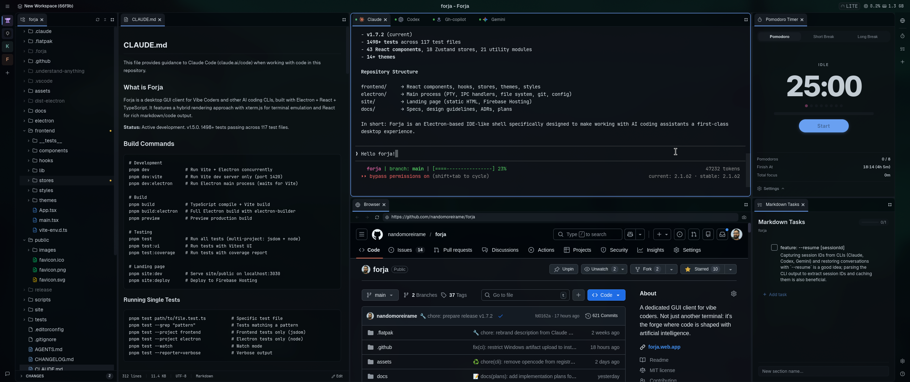

```
███████╗ ██████╗ ██████╗      ██╗ █████╗
██╔════╝██╔═══██╗██╔══██╗     ██║██╔══██╗
█████╗  ██║   ██║██████╔╝     ██║███████║
██╔══╝  ██║   ██║██╔══██╗██   ██║██╔══██║
██║     ╚██████╔╝██║  ██║╚█████╔╝██║  ██║
╚═╝      ╚═════╝ ╚═╝  ╚═╝ ╚════╝ ╚═╝  ╚═╝
```

A dedicated GUI client for Vibe Coders (and other AI coding CLIs), built with Electron + React. Not just another terminal: it's the forge where code is shaped with artificial intelligence.

> **Warning**
> Forja is under active development (beta stage). Expect incomplete features and tools, potential instability, crashes, or unexpected behavior, and breaking changes between updates without prior notice. Your settings and session data are stored locally and may need to be reset after major updates. We recommend keeping backups of important project configurations. Please [report issues](https://github.com/nandomoreirame/forja/issues) to help us improve.

## Screenshot



## Concept

Forja opens directly into Claude Code. The user picks a project directory and the session starts. The main experience is Claude Code with enhanced visual rendering (rich markdown, syntax-highlighted code blocks, visual diffs). Git context is always visible in the header.

## Features

- **Multi-CLI Support** - Claude Code, Gemini CLI, Codex CLI, Cursor Agent, and plain terminal sessions
- **Multi-Session Tabs** - Multiple concurrent sessions with tab management, context menus, inline rename
- **Project Selector** - Home screen with recent projects, filesystem browser, and drag-and-drop reorder
- **Terminal Emulation** - Full PTY via xterm.js with split panes (horizontal/vertical), independent zoom, and copy/paste
- **File Tree Sidebar** - Collapsible sidebar with lazy-loaded directory tree, file type icons, git status badges, and Ctrl+Shift+B toggle
- **File Preview Pane** - Syntax-highlighted code preview (Shiki), markdown rendering, image viewer, and Monaco editor integration
- **Git Integration** - Current branch, modified files counter, per-file git status badges, git diff viewer, auto-refresh via file watcher
- **Embedded Browser** - In-app browser pane with navigation toolbar, auto-opens on localhost URL detection in terminal output
- **Theme System** - 14+ built-in themes (Catppuccin, Dracula, Nord, Tokyo Night, Monokai Pro, and more) with live switching
- **Settings Editor** - In-app settings with syntax highlighting, live validation, font/theme/window configuration (Ctrl+,)
- **Workspaces** - Group multiple projects into named workspaces that open in dedicated windows
- **Command Palette** - Quick file navigation (Ctrl+P), command access (Ctrl+Shift+P), theme/session switching
- **Context System** - Context synchronization with import, sync status, and tool registry
- **Agent Chat** - Chat panel with slash command menu for AI CLI interaction
- **Keyboard Shortcuts** - Comprehensive shortcuts with customizable bindings, fullscreen toggle (F11)
- **Font Settings** - Separate font configuration for 3 areas: app UI, editor/preview, and terminal
- **Window Controls** - Custom titlebar with opacity and zoom level settings, configurable section visibility
- **System Metrics** - Demand-driven CPU, memory, swap, disk, and network metrics in status bar
- **Session Telemetry** - Real-time token usage, cost tracking, context bar with semantic colors
- **Discord Notifications** - Webhook notifications with PTY output summarization
- **Plugin System** - Plugin bridge, loader, registry, and permissions management
- **Session State** - Visual indicators for "thinking" vs "ready" states with notification support
- **Error Handling** - Graceful fallback when AI CLI is not installed

## Monorepo

Forja is organized as a pnpm monorepo with multiple applications and shared packages:

| Package | Path | Description |
|---------|------|-------------|
| **@forja/desktop** | `apps/desktop/` | Electron desktop app (main product) |
| **@forja/site** | `apps/site/` | Next.js 15 marketing site |
| **@forja/docs** | `apps/docs/` | Fumadocs documentation site |
| **@forja/mobile** | `apps/mobile/` | Expo remote control app (React Native) |
| **@forja/tsconfig** | `packages/tsconfig/` | Shared TypeScript configurations |
| **@forja/shared** | `packages/shared/` | Shared types and constants |

## Stack

| Technology | Purpose |
|-----------|---------|
| **Electron 32** | Desktop framework (Node.js backend + Chromium frontend) |
| **React 19 + TypeScript** | UI framework |
| **Tailwind CSS 4 + shadcn/ui** | Styling and components |
| **xterm.js 6 + node-pty** | Terminal emulation and PTY management |
| **Monaco Editor** | Code editing and diff viewing |
| **Shiki** | Syntax highlighting (14+ themes) |
| **react-markdown + remark-gfm** | Markdown output rendering |
| **Zustand 5** | State management |
| **FlexLayout** | Tiling window layout system |
| **chokidar 4** | File watching (.git/ changes, project files, settings) |
| **electron-store 10** | Config storage |
| **systeminformation** | System metrics (CPU, memory, disk, network) |
| **Discord.js 14** | Webhook notifications |
| **Lucide React** | Icon system |
| **@dnd-kit** | Drag-and-drop (project sidebar) |
| **Next.js 15** | Marketing site and documentation |
| **Fumadocs** | MDX documentation framework |
| **Expo 52 + React Native** | Mobile remote control app |
| **Vitest + React Testing Library** | Testing framework |

## Architecture

```
[React Frontend (Chromium)]
    |
    | Electron IPC (invoke + events)
    |
[Node.js Backend (Main Process)]
    +-- PTY Manager (node-pty)
    |   +-- Spawns claude / gemini / codex / terminal processes
    |   +-- Streams output -> Frontend via IPC events
    +-- File System (reader, writer, tree, cache, watcher)
    +-- File Watcher (chokidar)
    |   +-- Monitors .git/ for changes
    |   +-- Watches project files and settings for live reload
    +-- Git Reader (git CLI)
    |   +-- Branch info, file status, diff content
    +-- Context System (hub, sync, tool registry)
    +-- Plugin System (bridge, loader, registry, permissions)
    +-- WebSocket Bridge (mobile remote control)
    +-- Agent Chat (IPC-based AI CLI interaction)
    +-- Config Manager (electron-store)
    +-- User Settings (~/.config/forja/settings.json)
    +-- System Metrics (systeminformation, demand-driven)
```

### App Layout

```
+---------------------------------------------------+
|  Titlebar (40px) - menu + title + window controls  |
+------+--------------------+------------------------+
|      |                    |                        |
| File |  Terminal Pane     |  File Preview /        |
| Tree |  (xterm.js)        |  Browser / Settings    |
| 256px|  ~60% width        |  ~40% width            |
|      |                    |                        |
+------+--------------------+------------------------+
|  Status Bar (24px) - git info + system metrics      |
+---------------------------------------------------+
```

### Application Flow

```
Home Screen (Project Selector)
  -> User selects project directory
  -> Workspace opens
      +-- Tab Bar (multi-session management)
      +-- Terminal Pane (PTY + xterm.js + split panes)
      +-- File Tree Sidebar (directory structure + git status)
      +-- File Preview Pane (code + markdown + images + diffs)
      +-- Browser Pane (embedded webview, auto-opens on localhost)
      +-- Chat Panel (agent chat with slash commands)
      +-- Status Bar (git branch + system metrics + telemetry)
```

## Inspirations

- **Warp** - Modern terminal UX, integrated AI
- **Raycast** - Excellent dark mode, density, polish
- **Zed** - Minimal, performance-focused, dev tool aesthetic
- **Linear** - Consistency, spacing, typography

## What Makes Forja Different

- **AI CLI-first** - Not a generic terminal with AI; it's a dedicated GUI for Vibe Coders and other AI coding CLIs
- **Multi-CLI** - Supports Claude Code, Gemini CLI, Codex CLI, Cursor Agent, and plain terminal in a unified interface
- **Enhanced Rendering** - Markdown rendered as HTML, code blocks with syntax highlight via Shiki
- **Project-based** - Each session is isolated per project with automatic context
- **Theme System** - 14+ built-in editor themes with live switching
- **Open Source** - Open source from day 1

## Design

**Theme:** Catppuccin Mocha (default dark), with 14+ built-in themes

**Brand color:** `#cba6f7` (Catppuccin Mauve)

**Fonts:** Geist Sans (UI), JetBrains Mono (code/terminal)

Full design guidelines in `docs/design/DESIGN-GUIDELINES.md`.

## Installation

Download the latest release from [GitHub Releases](https://github.com/nandomoreirame/forja/releases):

- **macOS**: `.dmg` (Apple Silicon + Intel)
- **Linux**: `.AppImage` or `.deb`
- **Windows**: `.exe` (NSIS installer)

### Prerequisites

Forja requires at least one AI coding CLI installed:

```bash
# Claude Code (recommended)
npm install -g @anthropic-ai/claude-code

# Or Gemini CLI, Codex CLI, etc.
```

## Build from Source

```bash
# Clone
git clone https://github.com/nandomoreirame/forja.git
cd forja

# Install dependencies
pnpm install

# Run in development mode
pnpm dev

# Run tests
pnpm test

# Build for production
pnpm build:electron
```

See [CONTRIBUTING.md](CONTRIBUTING.md) for full development setup.

## Documentation

| Document | Description |
|----------|-------------|
| [Brief](docs/specs/BRIEF.md) | Executive summary, personas, business model |
| [PRD](docs/specs/PRD.md) | Full product requirements, user stories, technical spec |
| [MVP Scope](docs/specs/MVP-SCOPE.md) | What's in/out of MVP, timeline, stack decisions |
| [Design Guidelines](docs/design/DESIGN-GUIDELINES.md) | Complete design system (colors, typography, components) |
| [CONTRIBUTING](CONTRIBUTING.md) | Development setup, testing, and contribution guide |
| [CHANGELOG](CHANGELOG.md) | Version history and release notes |

## License

[MIT](LICENSE)
