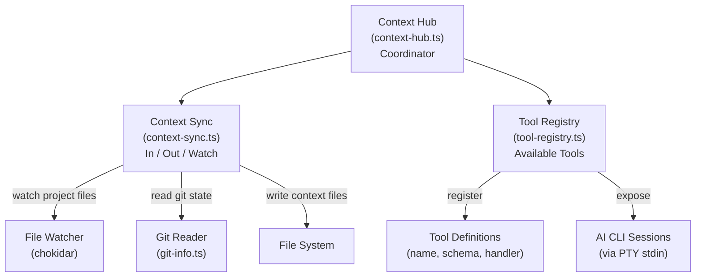
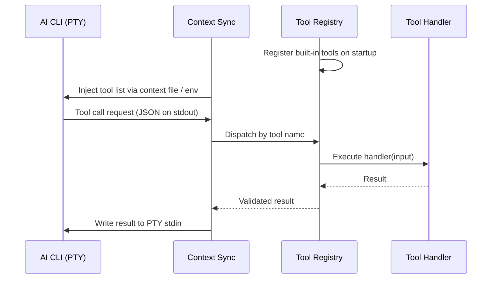

# Context System

The **Context System** is a set of modules in `electron/context/` that keep project state — open files, active session, git status, workspace metadata — synchronized with the AI CLI processes running inside PTY sessions. It bridges the gap between Forja's rich UI state and the context that AI CLIs need to understand your project.

## Architecture



## Context Hub

`electron/context/context-hub.ts` is the central coordinator. It owns the lifecycle of all context-related subsystems and exposes a clean API to `ipcMain` handlers:

- `hub.start(projectPath)` — initialize sync and tool registry for a project session.
- `hub.stop(sessionId)` — tear down watchers and flush any pending writes.
- `hub.getSnapshot(sessionId)` — return the current context state (used for reconnect recovery).

The hub ensures that only one sync loop runs per project path, even when multiple terminal tabs are open to the same project.

## Context Sync

`electron/context/context-sync.ts` handles the **inbound** and **outbound** flows of project context.

### Inbound — Watching and Reading

Context Sync watches the project directory and git state using the same chokidar-based watchers that drive the file tree and git badge updates. When relevant files change (for example, when a file is saved or a git commit is made), the sync module updates the in-memory context snapshot.

The snapshot captures:

| Field | Source |
|-------|--------|
| `openFiles` | Active file preview and editor tabs |
| `activeFile` | Currently focused file path |
| `gitBranch` | `git branch --show-current` |
| `gitDirty` | `git status --porcelain` (non-empty = dirty) |
| `gitModified` | List of modified/untracked file paths |
| `projectRoot` | Resolved absolute path |
| `sessionId` | Forja session identifier |

### Outbound — Writing Context Files

Many AI CLIs (including Claude Code) read context from files in the project directory (for example, `CLAUDE.md`) or from injected environment variables. Context Sync can write or update these files when the session starts, ensuring the CLI has accurate information about the current state of the project.

The outbound write is debounced — rapid state changes (for example, multiple file saves in quick succession) are coalesced into a single write.

### Watch Mode

In watch mode, Context Sync keeps an active chokidar watcher on the project directory at depth 2. When the watcher fires, it computes a diff against the previous snapshot and emits change events to the Context Hub, which propagates them to any subscribed consumers (UI stores, active PTY sessions).

## Tool Registry

`electron/context/tool-registry.ts` maintains the set of **tools** that are available to AI CLI sessions. A tool is a named, schema-validated capability that the CLI can invoke to interact with the host application — for example, reading a file, executing a terminal command, or querying git status.

### Tool Definition

```typescript
interface ToolDefinition {
  name: string;           // e.g. "read_file"
  description: string;    // Human-readable purpose
  inputSchema: JSONSchema; // Validated input shape
  handler: (input: unknown) => Promise<unknown>;
}
```

### Tool Lifecycle



### Built-in Tools

The registry ships with a set of built-in tools that map to existing IPC capabilities:

| Tool | Description |
|------|-------------|
| `read_file` | Read the contents of a file within the project scope |
| `write_file` | Write or update a file within the project scope |
| `list_directory` | List files in a directory (respects `.gitignore`) |
| `get_git_status` | Return current branch and modified file list |
| `run_terminal_command` | Execute a shell command and return output |

All tool handlers call `assertPathWithinScope()` before any file system operation. The tool registry validates the input against the tool's JSON schema before dispatching to the handler, ensuring the CLI cannot pass malformed data to Forja's internal APIs.
