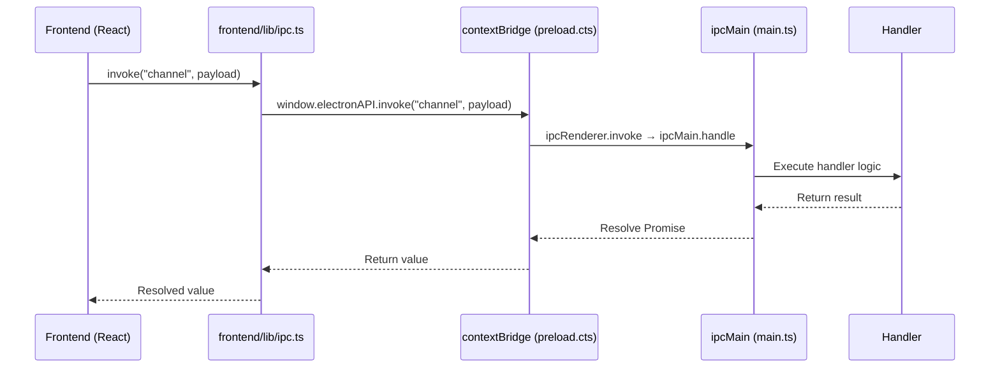
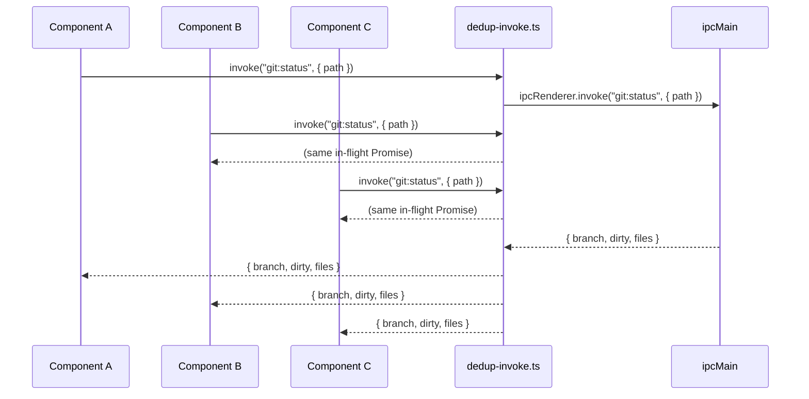

# IPC Layer

Forja's renderer process (React) and main process (Node.js) run in separate OS processes and cannot share memory. All communication happens through **Electron IPC** — a message-passing channel secured by a `contextBridge` in the preload script.

## contextBridge Pattern



The preload script (`electron/preload.cts`) runs in a privileged context with access to Node.js APIs but is isolated from the renderer's JavaScript environment. It uses `contextBridge.exposeInMainWorld` to expose a controlled `window.electronAPI` surface — the only bridge between the two worlds.

```typescript
// electron/preload.cts (simplified)
contextBridge.exposeInMainWorld("electronAPI", {
  invoke: (channel: string, ...args: unknown[]) =>
    ipcRenderer.invoke(channel, ...args),
  on: (channel: string, listener: (...args: unknown[]) => void) => {
    ipcRenderer.on(channel, (_event, ...args) => listener(...args));
  },
  off: (channel: string, listener: (...args: unknown[]) => void) => {
    ipcRenderer.removeListener(channel, listener);
  },
});
```

## Two Communication Modes

`frontend/lib/ipc.ts` provides two primitives that all frontend code should use instead of calling `window.electronAPI` directly.

| Mode | Function | Pattern | Use case |
|------|----------|---------|---------|
| Request / Response | `invoke(channel, payload?)` | Returns `Promise<T>` | Load config, read files, spawn PTY |
| Event subscription | `listen(channel, handler)` | Returns cleanup function | PTY output, file changes, git updates |

### `invoke` — Request / Response

Use `invoke` when you need a one-time answer from the main process.

```typescript
import { invoke } from "@/lib/ipc";

// Load the project config
const config = await invoke<AppConfig>("config:load");

// Read a file from disk
const content = await invoke<string>("fs:readFile", { path: "/project/main.ts" });

// Spawn a new PTY session
const sessionId = await invoke<string>("pty:spawn", {
  cli: "claude",
  cwd: "/project",
});
```

### `listen` — Event Subscription

Use `listen` when you need to react to a stream of events pushed from the main process. Always call the returned cleanup function when the component unmounts.

```typescript
import { listen } from "@/lib/ipc";
import { useEffect } from "react";

function TerminalPane({ sessionId }: { sessionId: string }) {
  useEffect(() => {
    // Subscribe to PTY output for this session
    const unlisten = listen<string>(`pty:output:${sessionId}`, (data) => {
      terminal.write(data);
    });

    // Cleanup: remove IPC listener when component unmounts
    return unlisten;
  }, [sessionId]);
}
```

## IPC Deduplication

When multiple components mount simultaneously and each calls the same `invoke` channel (for example, three sidebar items all calling `git:status` on the same project), the naive approach sends three identical IPC messages to the main process.

`frontend/lib/dedup-invoke.ts` solves this with an **in-flight request map**: if a call for the same channel+arguments is already pending, the second and third callers receive the same Promise. The main process receives exactly one message.



Once the Promise settles (resolved or rejected), the entry is removed from the map so subsequent calls start fresh.

## Backpressure

PTY sessions can produce output at very high rates (tens of thousands of characters per second). Forja applies two mechanisms to prevent the renderer from being overwhelmed.

### Batched Broadcasting via requestAnimationFrame

PTY output events are not forwarded to the renderer on every byte. The main process buffers incoming chunks and flushes them in batches aligned to `requestAnimationFrame` timing (~16ms at 60 fps). This keeps the renderer's event loop free between frames.

### Circuit Breaker for WebSocket Clients

When a WebSocket client (mobile remote control, external API consumer) is connected but consuming messages too slowly, the outbound queue grows unbounded. A circuit breaker tracks queue depth per client. When the queue exceeds the high-water mark, the circuit opens: new messages are dropped for that client until the queue drains below the low-water mark.

| Threshold | Behaviour |
|-----------|-----------|
| Queue depth > high-water mark | Circuit opens; messages dropped for this client |
| Queue depth < low-water mark | Circuit closes; normal delivery resumes |
| Client disconnects | Queue and circuit state are discarded |

## Security Model

Forja's IPC architecture is hardened against renderer-side code execution attacks.

| Setting | Value | Effect |
|---------|-------|--------|
| `nodeIntegration` | `false` | Renderer cannot call Node.js APIs directly |
| `contextIsolation` | `true` | Renderer's JS environment is isolated from the preload script |
| `sandbox` | `true` | Renderer runs in the Chromium sandbox (no OS access) |

### Path Scope Validation

Every IPC handler that reads or writes the file system calls `assertPathWithinScope(requestedPath, projectRoot)` before proceeding. This prevents path-traversal attacks where a malicious page or a compromised renderer tries to read files outside the current project directory.

```typescript
// electron/path-validation.ts
export function assertPathWithinScope(targetPath: string, scopeRoot: string): void {
  const resolved = path.resolve(targetPath);
  const scope = path.resolve(scopeRoot);
  if (!resolved.startsWith(scope + path.sep) && resolved !== scope) {
    throw new Error(`Path "${resolved}" is outside allowed scope "${scope}"`);
  }
}
```

If the assertion throws, the IPC handler rejects the Promise and nothing is read from or written to disk.
