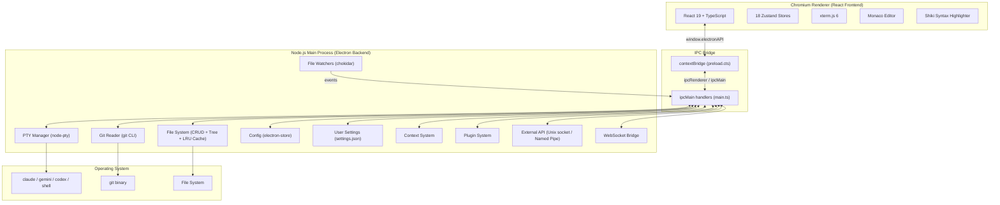
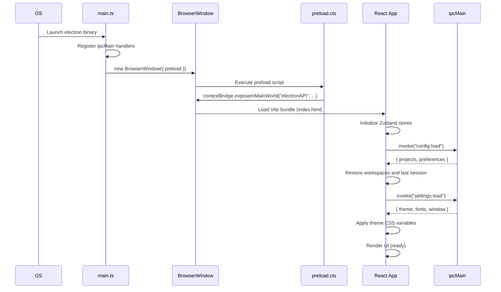

# Architecture Overview

Forja is a desktop application built on **Electron 32**, combining a **Node.js main process** (backend) with a **Chromium renderer** (React 19 frontend). The two sides communicate exclusively through Electron's IPC mechanism — the renderer never has direct access to Node.js APIs.

## Process Architecture



## Application Layout

The Forja UI is divided into fixed-size chrome regions and flexible content panes:

```
┌──────────────────────────────────────────────────────────┐
│  Titlebar                                          40px   │
├───────────────┬──────────────────────────────────────────┤
│               │  Pane Header                      36px   │
│  File Tree    ├─────────────────────┬────────────────────┤
│               │                     │                    │
│  256px        │  Terminal Pane      │  Preview /         │
│               │  (~60%)             │  Browser           │
│               │                     │  (~40%)            │
│               │                     │                    │
├───────────────┴─────────────────────┴────────────────────┤
│  Status Bar                                        24px   │
└──────────────────────────────────────────────────────────┘
```

| Region | Height / Width | Purpose |
|--------|---------------|---------|
| Titlebar | 40px | Window controls, workspace/project switcher, settings |
| File Tree | 256px fixed | Project file browser with git status badges |
| Terminal Pane | ~60% flex | xterm.js PTY output + rich markdown renderer |
| Preview / Browser | ~40% flex | Syntax-highlighted file preview and embedded browser |
| Status Bar | 24px | Git branch, session state, system metrics |

## Application Startup Flow



## Key Source Files

All paths below are relative to `apps/desktop/`.

| File | Purpose |
|------|---------|
| `electron/main.ts` | Entry point; registers all `ipcMain` handlers and creates `BrowserWindow` |
| `electron/preload.cts` | `contextBridge` — exposes `window.electronAPI` to the renderer |
| `electron/pty.ts` | PTY lifecycle management via `node-pty` |
| `electron/watcher.ts` | Git directory watcher (`500ms` debounce, chokidar) |
| `electron/file-watcher.ts` | Project file watcher (`1s` debounce, depth 3, chokidar) |
| `electron/git-info.ts` | Git status reader using the `git` CLI |
| `electron/paths.ts` | Cross-platform config path utilities (`getForjaConfigDir()`) |
| `electron/config.ts` | Persistent config via `electron-store` (`~/.config/forja/config.json`) |
| `electron/user-settings.ts` | User preferences (`~/.config/forja/settings.json`) |
| `electron/context/` | Context synchronization system (6 modules) |
| `electron/plugins/` | Plugin system (4 modules) |
| `frontend/lib/ipc.ts` | IPC abstraction layer (`invoke` + `listen`) |
| `frontend/lib/dedup-invoke.ts` | Deduplicates concurrent identical IPC calls |
| `frontend/stores/` | 18 Zustand state stores |
| `frontend/themes/index.ts` | Theme registry (14+ themes) |

## Technology Stack at a Glance

### Frontend (Chromium renderer)

| Technology | Role |
|-----------|------|
| React 19 + TypeScript | UI component tree |
| Tailwind CSS 4 + shadcn/ui | Styling and design system components |
| xterm.js 6 | PTY output rendering (VT sequences) |
| Monaco Editor | Code editing (settings, file editor) |
| react-markdown + remark-gfm | Markdown output rendering |
| Shiki | Syntax highlighting (Catppuccin Mocha default) |
| Zustand 5 | Client-side state management |
| @dnd-kit | Drag-and-drop (project sidebar reorder) |
| @tanstack/react-virtual | Virtualized lists (file tree) |

### Backend (Node.js main process)

| Technology | Role |
|-----------|------|
| Electron 32 | Desktop framework (Node.js + Chromium) |
| node-pty | PTY management; spawns AI CLI processes |
| chokidar 4 | File and git directory watching |
| electron-store 10 | Config persistence |
| systeminformation | CPU, memory, disk, network metrics |
| git CLI | Branch info and file status via `child_process` |
