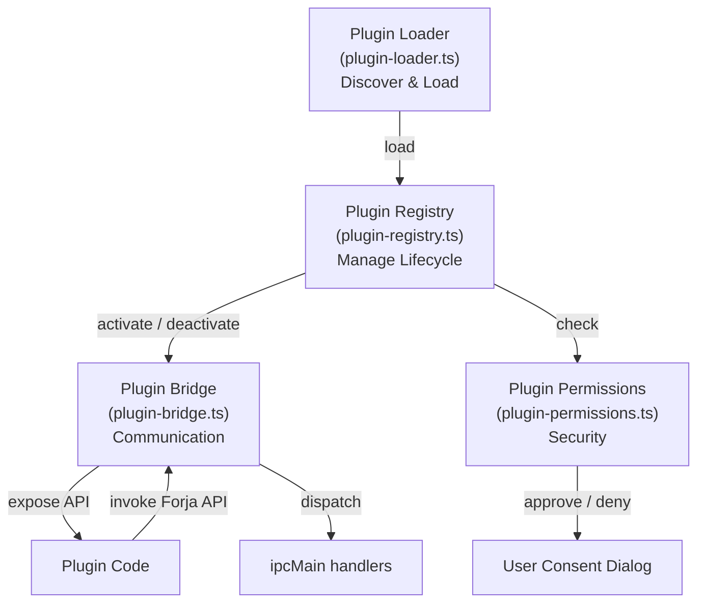
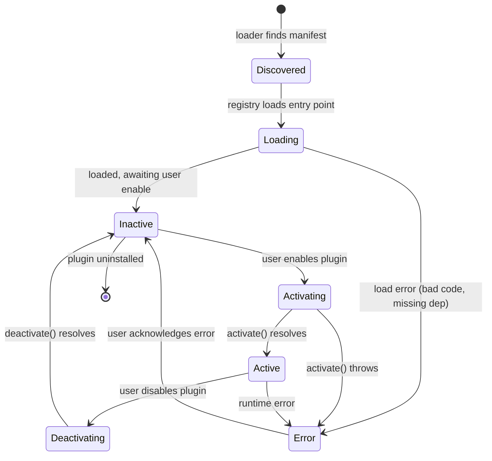
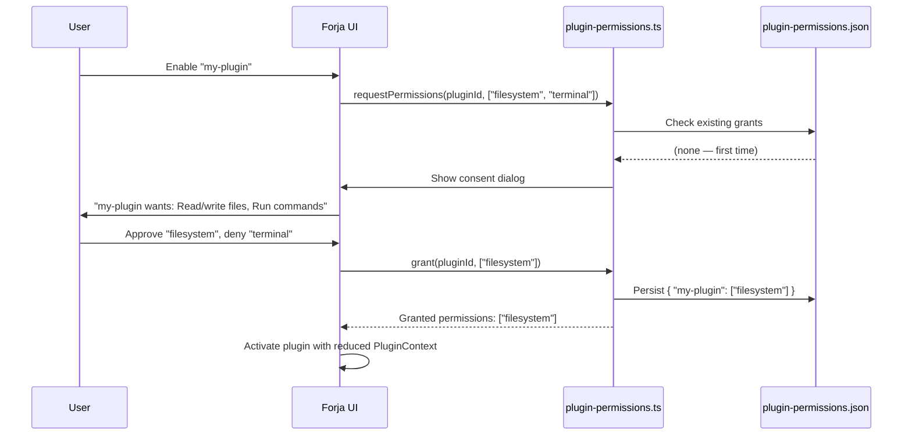
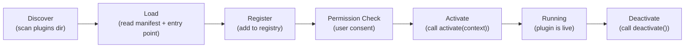

# Plugin System

Forja's plugin system allows third-party code to extend the application with new UI panels, custom CLI wrappers, additional context tools, and deep integrations with external services. Plugins run in a sandboxed context inside the main process and communicate with the rest of the application through a controlled bridge.

The plugin system lives in `electron/plugins/` and is composed of four modules.

## Architecture



## Four Modules

### Plugin Loader (`plugin-loader.ts`)

The loader is responsible for **discovering** and **loading** plugin packages from disk. It scans a well-known plugins directory (`~/.config/forja/plugins/` on Unix, `%APPDATA%\forja\plugins\` on Windows) for valid plugin manifests.

A valid plugin directory contains:

```
my-plugin/
├── plugin.json      ← manifest
└── index.js         ← entry point (CommonJS)
```

The loader:

1. Reads and validates `plugin.json` against the manifest schema.
2. Resolves the entry point path.
3. Returns a `LoadedPlugin` object to the registry — it does not execute the plugin code yet.

```typescript
// plugin.json manifest shape
interface PluginManifest {
  id: string;            // Unique reverse-domain ID: "com.example.my-plugin"
  name: string;          // Display name
  version: string;       // semver
  description: string;
  author: string;
  main: string;          // Entry point relative to plugin dir
  permissions: string[]; // Requested permissions
  minForjaVersion: string; // Minimum compatible Forja version
}
```

### Plugin Registry (`plugin-registry.ts`)

The registry is the **lifecycle manager** for all loaded plugins. It tracks the state of each plugin and drives the activate/deactivate transitions.



When activating a plugin, the registry:

1. Checks that all declared permissions have been granted by the user (via Plugin Permissions).
2. Creates a scoped `PluginContext` and passes it to the plugin's `activate(context)` function.
3. If activation succeeds, marks the plugin as `Active` and registers its exposed capabilities.

### Plugin Bridge (`plugin-bridge.ts`)

The bridge is the **communication layer** between plugin code and the rest of Forja. It wraps the subset of internal APIs that plugins are allowed to call and enforces permission checks on every call.

Plugins never call `ipcMain` directly. They receive a `PluginContext` object from the bridge, which exposes a permission-gated API surface:

```typescript
interface PluginContext {
  // File system (requires "filesystem" permission)
  fs: {
    readFile(path: string): Promise<string>;
    writeFile(path: string, content: string): Promise<void>;
    listDirectory(path: string): Promise<string[]>;
  };

  // Terminal (requires "terminal" permission)
  terminal: {
    runCommand(command: string): Promise<{ stdout: string; stderr: string }>;
    openSession(options: SessionOptions): Promise<string>;
  };

  // UI extension points (requires "ui" permission)
  ui: {
    registerPanel(definition: PanelDefinition): void;
    showNotification(message: string, type?: "info" | "warn" | "error"): void;
  };

  // Git info (requires "git" permission)
  git: {
    getStatus(): Promise<GitStatus>;
  };

  // Events
  on(event: string, handler: (...args: unknown[]) => void): () => void;
  emit(event: string, ...args: unknown[]): void;
}
```

Every method on `PluginContext` first queries `plugin-permissions.ts` to verify the plugin holds the required permission before dispatching to the underlying handler.

### Plugin Permissions (`plugin-permissions.ts`)

The permissions module enforces the **plugin permission model** — the mechanism by which users control what each plugin can do.

#### Permission Declarations

Plugins declare their required permissions in `plugin.json`. The full list of available permissions is:

| Permission | Grants access to |
|-----------|-----------------|
| `filesystem` | Read and write files within the project scope |
| `terminal` | Execute shell commands and open new terminal sessions |
| `ui` | Register custom UI panels and send notifications |
| `git` | Read git status, branch, and diff information |
| `network` | Make outbound HTTP/HTTPS requests |
| `settings` | Read (not write) user settings |

#### User Approval Flow

When a plugin is enabled for the first time, Forja presents a **consent dialog** listing all the permissions the plugin has declared. The user can approve all, approve a subset, or deny. The decision is persisted in `~/.config/forja/plugin-permissions.json`.



If a plugin attempts to use an API that requires a permission it does not hold, the bridge throws a `PermissionDeniedError` and logs the attempt. The plugin is not deactivated — it is expected to handle the error gracefully.

## Plugin Lifecycle Summary



Plugins are expected to implement two exported functions:

```typescript
// my-plugin/index.js
exports.activate = function (context) {
  // Register capabilities, subscribe to events
  context.ui.registerPanel({ id: "my-panel", title: "My Panel", component: ... });
};

exports.deactivate = function () {
  // Clean up subscriptions, timers, open handles
};
```

Forja calls `deactivate()` before updating or uninstalling a plugin to give it a chance to release resources cleanly.
