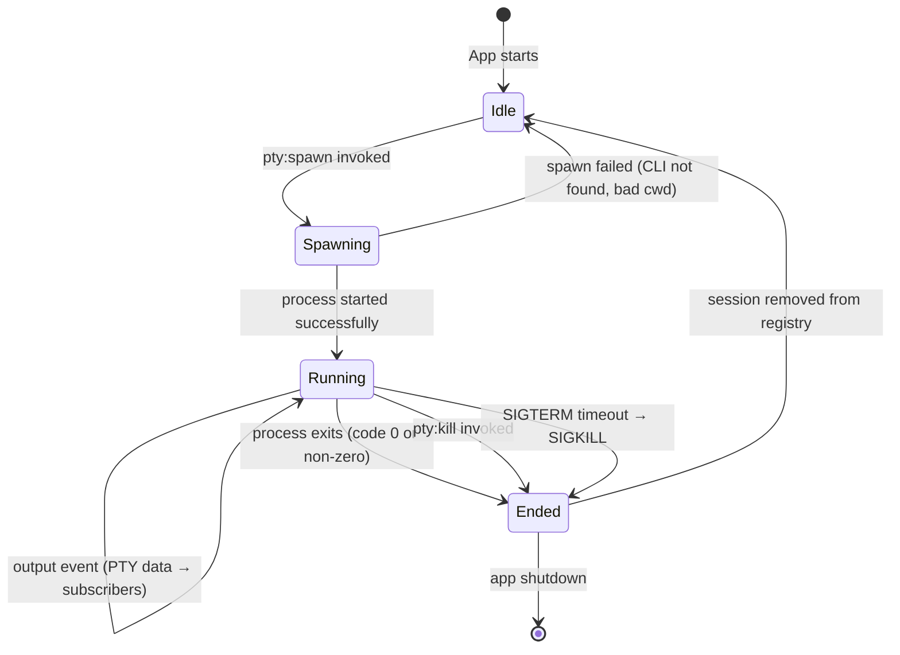
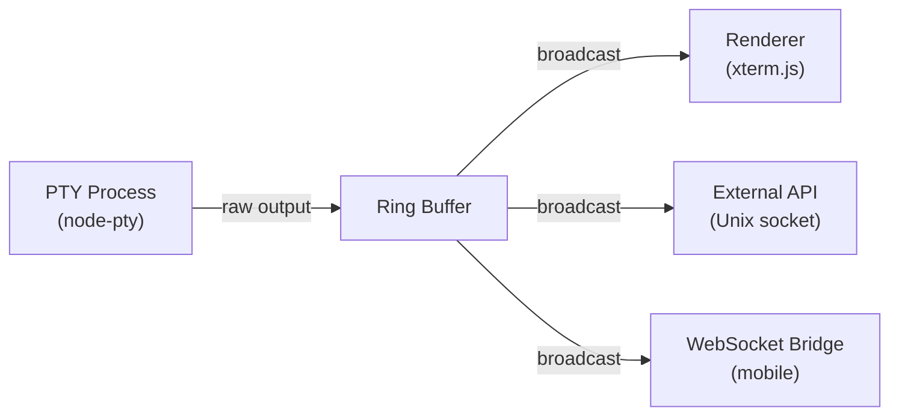

# PTY System

Forja spawns AI CLI processes (Claude Code, Gemini CLI, Codex CLI) and plain shell sessions inside **pseudo-terminals (PTYs)**. A PTY is an OS-level pair of file descriptors that emulates a hardware terminal: the spawned process writes VT/ANSI sequences to it as if talking to a real terminal, and Forja reads those sequences and feeds them to xterm.js for rendering.

PTY management lives in `electron/pty.ts` and is driven entirely by `ipcMain` handlers registered in `electron/main.ts`.

## PTY Lifecycle



## Spawning a Process

When the renderer calls `invoke("pty:spawn", options)`, the main process:

1. Validates the requested CLI binary exists on `PATH` (cross-platform: `where.exe` on Windows, `which` on Unix).
2. Filters the current process environment to remove sensitive variables.
3. Calls `node-pty`'s `spawn()` with the resolved shell/CLI binary.
4. Registers the PTY instance in an in-memory session registry keyed by `sessionId`.
5. Attaches output, exit, and error listeners.
6. Returns the `sessionId` to the renderer.

### Spawn Parameters

| Parameter | Description |
|-----------|-------------|
| `name` | Terminal type reported to the child (`xterm-256color`) |
| `cols` / `rows` | Initial terminal dimensions in characters |
| `cwd` | Working directory — the open project root |
| `env` | Filtered environment (see below) |
| `encoding` | `utf8` |

### Cross-Platform Shell Selection

| Platform | Default shell |
|----------|--------------|
| Windows | `powershell.exe` |
| macOS | `$SHELL` (from environment, falls back to `/bin/zsh`) |
| Linux | `$SHELL` (falls back to `/bin/bash`) |

For AI CLIs the binary path is resolved explicitly, not through the shell.

## Environment Variable Filtering

To prevent secrets from leaking into child processes, Forja filters the environment before spawning. Variables in a deny-list (containing patterns like `KEY`, `SECRET`, `TOKEN`, `PASSWORD`, `CREDENTIAL`) are removed. The exact deny-list is defined in `electron/pty.ts`.

The filtered environment is a shallow copy of `process.env` — the AI CLI still inherits `PATH`, `HOME`, `TERM`, `LANG`, and all other non-sensitive variables it needs to operate.

## Ring Buffer

Every PTY session maintains a **ring buffer** in memory. As output arrives from the child process, it is appended to the ring buffer before being broadcast to subscribers. The ring buffer has a configurable maximum size (in bytes); when the buffer is full, the oldest bytes are discarded to make room.

The ring buffer serves two purposes:

- **Reconnect recovery** — when a renderer component remounts (e.g., the user switches tabs and returns), it receives the buffered output and can re-populate xterm.js without losing session history.
- **Bounded memory** — long-running AI sessions that produce megabytes of output do not grow unbounded; the oldest output is automatically pruned.

```
┌───────────────────────────────────────┐
│  Ring Buffer (fixed capacity in bytes) │
│                                       │
│  [oldest] → → → → → → [newest]        │
│                                ↑      │
│            write pointer ──────┘      │
└───────────────────────────────────────┘
```

## Subscriber Broadcasting

Multiple consumers may need to receive output from the same PTY session simultaneously:

- The **xterm.js terminal pane** in the renderer (primary consumer).
- The **External API** — scripts or bots connected via Unix socket / named pipe.
- The **WebSocket bridge** — the mobile remote control client.

`electron/pty.ts` maintains a **subscriber set** per session. When PTY output arrives, it is broadcast to all registered subscribers in a single loop. Subscribers register themselves by session ID and are automatically removed when they disconnect or when the session ends.



## Resize

When the user resizes the terminal pane, the renderer calls `invoke("pty:resize", { sessionId, cols, rows })`. The main process calls `ptyProcess.resize(cols, rows)` which sends a `SIGWINCH` signal to the child process, allowing it to re-render its output to the new dimensions (for example, Claude Code reflowing its diff output).

## Graceful Shutdown

When a session is killed (user closes the tab, calls `invoke("pty:kill", { sessionId })`, or the app quits), Forja attempts a graceful shutdown:

1. Send `SIGTERM` to the child process group.
2. Wait up to **3 seconds** for the process to exit cleanly.
3. If the process is still running after the timeout, send `SIGKILL`.

On Windows, where POSIX signals are not available, `node-pty` uses `taskkill /F /PID` for the forceful kill step.

After the process exits, the session is removed from the registry, its ring buffer is cleared, and all subscribers are notified with a final `pty:exit` event.
