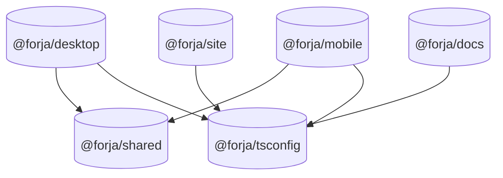

# Monorepo Structure

Forja is a pnpm monorepo managed with [pnpm workspaces](https://pnpm.io/workspaces). All apps and packages live in a single repository and share common TypeScript configs and runtime types.

## Packages

| Package | Path | Description |
|---------|------|-------------|
| `@forja/desktop` | `apps/desktop/` | Electron desktop application (main + renderer) |
| `@forja/site` | `apps/site/` | Next.js 15 marketing site |
| `@forja/docs` | `apps/docs/` | Fumadocs documentation site |
| `@forja/mobile` | `apps/mobile/` | Expo remote control app |
| `@forja/tsconfig` | `packages/tsconfig/` | Shared TypeScript configuration presets |
| `@forja/shared` | `packages/shared/` | Shared runtime types and constants |

## Dependency graph



`@forja/shared` is the only package with runtime cross-app dependencies. `@forja/tsconfig` is a dev-only dependency — it provides TypeScript config presets, not runtime code.

## workspace:* protocol

Internal packages reference each other using the `workspace:*` protocol in `package.json`. This means pnpm links the local package directly rather than resolving from the registry:

```json
{
  "dependencies": {
    "@forja/shared": "workspace:*"
  },
  "devDependencies": {
    "@forja/tsconfig": "workspace:*"
  }
}
```

When you publish a release, `pnpm publish` automatically replaces `workspace:*` with the resolved version number.

## Shared TypeScript configs (`@forja/tsconfig`)

The `packages/tsconfig` package provides four base configurations:

| Config | Preset | Used by |
|--------|--------|---------|
| `base` | `tsconfig/base.json` | Any TypeScript project |
| `react` | `tsconfig/react.json` | React renderer (Vite) |
| `node` | `tsconfig/node.json` | Node.js processes (Electron main, scripts) |
| `nextjs` | `tsconfig/nextjs.json` | Next.js apps (site, docs) |

To extend a preset in a package's `tsconfig.json`:

```json
{
  "extends": "@forja/tsconfig/react",
  "compilerOptions": {
    "baseUrl": ".",
    "paths": { "@/*": ["./frontend/*"] }
  },
  "include": ["frontend/**/*"]
}
```

## Shared types (`@forja/shared`)

The `packages/shared` package exports runtime constants and TypeScript types used by both the desktop app and the mobile app. Keeping them in one place prevents drift between the two consumers.

```typescript
// packages/shared/src/constants.ts
export const WS_BRIDGE_PORT = 9400;
export const WS_BRIDGE_HOST = "127.0.0.1";
export const WS_MAX_MESSAGES_PER_SECOND = 10;
export const WS_MAX_CLIENTS = 5;

// packages/shared/src/types.ts
export interface ActiveSession { ... }
export interface ProjectInfo { ... }
export interface WsBridgeStatus { ... }
export type ExternalCommand = ...;
export type PtySubscriberEvent = ...;
export type ApiResponse<T> = ...;
```

Import from the package directly:

```typescript
import { WS_BRIDGE_PORT, ActiveSession } from "@forja/shared";
```

## Working with specific packages

Use pnpm's `--filter` flag to run commands scoped to a single package:

```bash
# Run dev server for desktop only
pnpm --filter @forja/desktop dev

# Run tests for a specific package
pnpm --filter @forja/desktop test
pnpm --filter @forja/shared test

# Add a dependency to a specific package
pnpm --filter @forja/site add next

# Add a dev dependency to the shared package
pnpm --filter @forja/tsconfig add -D typescript
```

## CI/CD

Two GitHub Actions workflows manage automated checks and releases:

### `ci.yml` — Tests and build verification

Runs on every push and pull request to `main`:

1. Install dependencies (`pnpm install`)
2. TypeScript type check (`pnpm build`)
3. Run all tests (`pnpm test`)

### `release.yml` — GitHub Releases and binary distribution

Triggered when a `release/X.Y` branch is merged to `main` or a version tag is pushed:

1. Run the full test suite
2. Build Electron distributables via `electron-builder` with a matrix strategy:
   - `macos-latest` — produces `.dmg` (arm64 + x64 universal)
   - `ubuntu-latest` — produces `.AppImage` and `.deb`
   - `windows-latest` — produces `.exe` (NSIS installer)
3. Upload artifacts to the GitHub Release

Release branches follow the pattern `release/X.Y` (e.g. `release/1.9`). Patch releases are cut from the same branch.
