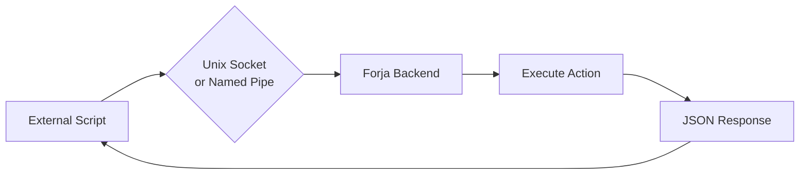

# External API Overview

Forja exposes a local socket-based API that allows external scripts, tools, and integrations to control the running desktop application programmatically. No network exposure is involved — the API is strictly local and only accessible to processes running on the same machine.

## Transport layer

| Platform | Transport | Path |
|----------|-----------|------|
| **macOS / Linux** | Unix domain socket | `/tmp/forja.sock` |
| **Windows** | Named pipe | `\\.\pipe\forja` |

The socket is created when Forja starts and removed when it exits. If Forja is not running, any connection attempt will fail immediately with `ENOENT` or `ECONNREFUSED`.

## Protocol

Commands are sent as newline-delimited JSON over the socket. Each message is a single JSON object followed by a `\n` character. Forja responds with a single JSON line.

```
Request:  {"type":"list-sessions"}\n
Response: {"ok":true,"data":[...]}\n
```

All responses follow the `ApiResponse<T>` shape:

```typescript
type ApiResponse<T = unknown> =
  | { ok: true; data?: T }
  | { ok: false; error: string };
```

## Available commands

| Command type | Required fields | Description |
|--------------|----------------|-------------|
| `ping` | — | Check if Forja is running. Returns version. |
| `list-sessions` | — | List all active PTY sessions. |
| `list-projects` | — | List all open projects. |
| `new-session` | `sessionType`, `projectPath?` | Start a new session. Types: `claude`, `codex`, `gemini`, `gh-copilot`, `terminal`. |
| `close-session` | `tabId` | Close an active session by tab ID. |
| `session-output` | `tabId` | Get the buffered output of a session. |
| `session-input` | `tabId`, `text` | Send text input to a session. |
| `open-project` | `projectPath` | Open a project directory in Forja. |
| `switch-project` | `index` | Switch the focused project by its list index (1-based). |
| `notify` | `message`, `projectPath?` | Display a notification inside Forja. |
| `screenshot` | — | Capture a screenshot of the Forja window. |
| `subscribe` | `tabId` | Subscribe to live output events for a session. |
| `unsubscribe` | `tabId` | Unsubscribe from a session. |

## Flowchart



## Authentication

There is no token-based authentication for the Unix socket API. Access control is provided by the operating system's file permissions on the socket file. Only processes running as the same user (or root) can connect.

The socket is **not accessible over the network** — it is a local IPC mechanism only.

## Error handling

If Forja is not running, the connection will fail at the OS level before any data is sent. Your client should handle `ENOENT` and `ECONNREFUSED` errors explicitly.

If a command fails at the application level, Forja returns `{ ok: false, error: "..." }` with a human-readable error message.

```bash
# Example: Forja not running
$ forja ping
Forja is not running

# Example: invalid tabId
$ forja send bad-tab-id "hello"
Error: Session not found: bad-tab-id
```
