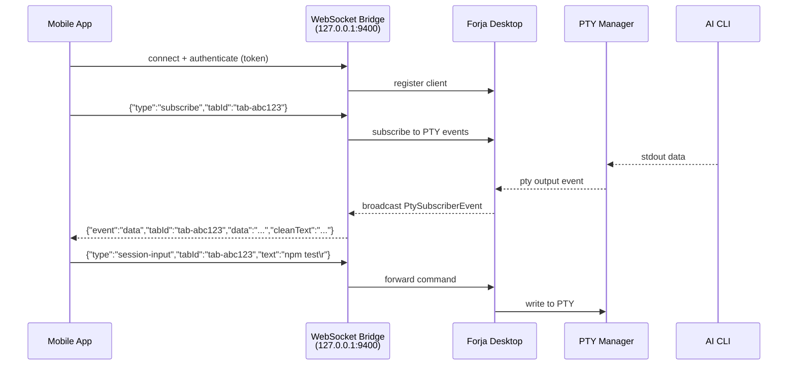

# WebSocket Bridge

The WebSocket bridge is an optional local server embedded in the Forja desktop application. It exposes a real-time WebSocket interface that allows the [Forja mobile app](/docs/mobile) to subscribe to live PTY output and send commands to active sessions — all without leaving your local network.

## Architecture



## Connection details

The bridge is disabled by default and must be enabled in Forja's settings. Once enabled, it binds to localhost only and is not accessible from outside the machine without port forwarding.

| Constant | Value | Description |
|----------|-------|-------------|
| `WS_BRIDGE_PORT` | `9400` | Default port the bridge listens on |
| `WS_BRIDGE_HOST` | `127.0.0.1` | Bind address (loopback only) |
| `WS_MAX_MESSAGES_PER_SECOND` | `10` | Rate limit per connected client |
| `WS_MAX_CLIENTS` | `5` | Maximum concurrent WebSocket connections |

These constants are exported from `@forja/shared` and used by both the desktop backend and the mobile app.

## Shared types

All messages exchanged over the WebSocket bridge use types defined in `@forja/shared`:

### `ActiveSession`

Represents an active PTY session exposed via the API.

```typescript
interface ActiveSession {
  tabId: string;
  projectPath: string;
  sessionType: string;
  displayName: string; // e.g. "Claude", "Gemini CLI"
}
```

### `ProjectInfo`

A project entry returned by `list-projects`.

```typescript
interface ProjectInfo {
  path: string;
  name: string;
}
```

### `WsBridgeStatus`

Bridge status returned by the desktop app on request.

```typescript
interface WsBridgeStatus {
  running: boolean;
  port: number;
  host: string;
  clients: number;
  token: string;
}
```

### `PtySubscriberEvent`

Events broadcast from the desktop to subscribed clients.

```typescript
type PtySubscriberEvent =
  | {
      event: "data";
      tabId: string;
      data: string;
      /**
       * Sanitized plain-text rendering of the screen buffer.
       * TUI chrome is stripped. Only present in WebSocket broadcasts.
       */
      cleanText?: string;
    }
  | { event: "session-start"; tabId: string; projectPath: string; sessionType: string }
  | { event: "session-exit"; tabId: string; projectPath: string; exitCode: number }
  | { event: "resize"; tabId: string; cols: number; rows: number };
```

### `ExternalCommand`

All commands accepted by both the Unix socket API and the WebSocket bridge.

```typescript
type ExternalCommand =
  | { type: "ping" }
  | { type: "list-sessions" }
  | { type: "list-projects" }
  | { type: "new-session"; sessionType: string; projectPath?: string }
  | { type: "close-session"; tabId: string }
  | { type: "session-output"; tabId: string }
  | { type: "session-input"; tabId: string; text: string }
  | { type: "subscribe"; tabId: string }
  | { type: "unsubscribe"; tabId: string }
  | { type: "open-project"; projectPath: string }
  | { type: "switch-project"; index: number }
  | { type: "notify"; message: string; projectPath?: string }
  | { type: "screenshot" };
```

## Security

The bridge includes several layers of protection:

**Rate limiting** — Each connected client is limited to `WS_MAX_MESSAGES_PER_SECOND` (10) messages per second. Clients that exceed this limit are disconnected automatically.

**Client cap** — A maximum of `WS_MAX_CLIENTS` (5) concurrent connections are allowed. New connections are rejected with an error when the cap is reached.

**Localhost only** — The bridge binds to `127.0.0.1` and never listens on a public interface. Accessing it from another machine requires explicit port forwarding.

**Token authentication** — A one-time token is generated when the bridge starts. Clients must present this token during the WebSocket handshake. The token is displayed in Forja's settings panel and can be shared with the mobile app via QR code.

<Callout type="warning">
  Do not expose port 9400 to untrusted networks. The bridge assumes a trusted local environment — it does not use TLS.
</Callout>

## Enabling the bridge

1. Open Forja settings (`Ctrl+,`).
2. Navigate to **Sessions > WebSocket Bridge**.
3. Toggle **Enable WebSocket Bridge** on.
4. Scan the QR code with the Forja mobile app, or copy the connection URL manually.

The bridge starts immediately and stops when you toggle it off or quit Forja.
