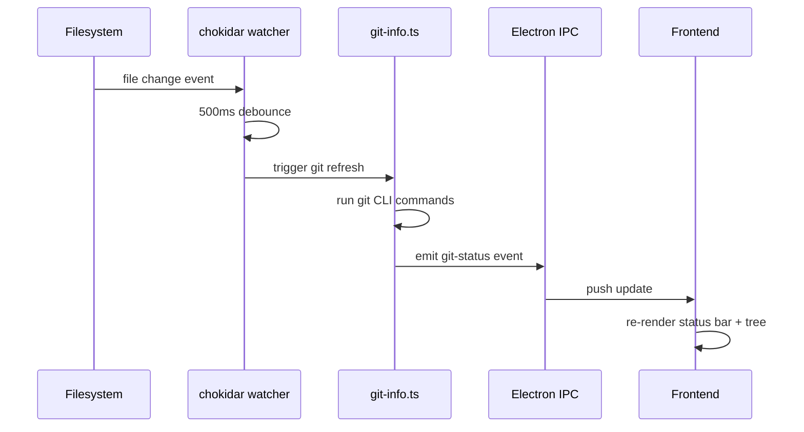

# Git Integration

Forja provides continuous git awareness without embedding a git library. It shells out to the `git` CLI and surfaces the results in the status bar, file tree, and a dedicated Git Changes panel.

## Status Bar

The bottom status bar always shows:

- **Current branch name** — e.g., `main` or `feature/new-ui`
- **Modified file count** — number of files with uncommitted changes
- **Dirty indicator** — a dot or asterisk when the working tree is not clean

For projects that are not git repositories, the status bar shows **Not a git repository** and all git-related UI elements are hidden.

## Auto-Refresh Pipeline

Git status is refreshed automatically whenever the filesystem changes, using the following pipeline:

The 500ms debounce prevents excessive git invocations during bulk writes (e.g., after a `pnpm install`). Git results are TTL-cached per project to coalesce rapid successive refreshes.

## Git Changes Panel

The Git Changes panel (accessible from the sidebar or with `Ctrl+Shift+G`) lists all modified files grouped by state:

- **Unstaged** — modified files not yet staged
- **Staged** — files added to the index
- **Untracked** — new files not tracked by git

Clicking a file in the panel opens the [diff viewer](/docs/features/file-preview#git-diff-viewer) for that file in the File Preview Pane.

## Diff Viewer

The diff viewer renders a **side-by-side Monaco Diff Editor** comparing the HEAD version against the current working tree:

- Green lines — added content
- Red lines — removed content
- Character-level highlights within changed lines
- Synchronized scrolling between left and right panels

The diff viewer is read-only. All staging and commit operations must be performed via the CLI session or a separate git tool.

## Non-Git Projects

When you open a folder that is not inside a git repository:

- The branch indicator in the status bar shows **Not a git repository**
- The git status badges in the file tree are hidden
- The Git Changes panel shows an empty state with a prompt to initialize git
- The diff viewer is unavailable

All other Forja features work normally for non-git projects.

<Callout type="info">
  Forja only reads git data — it never stages, commits, or modifies the repository state. All git write operations happen through the AI CLI session or your terminal.
</Callout>
