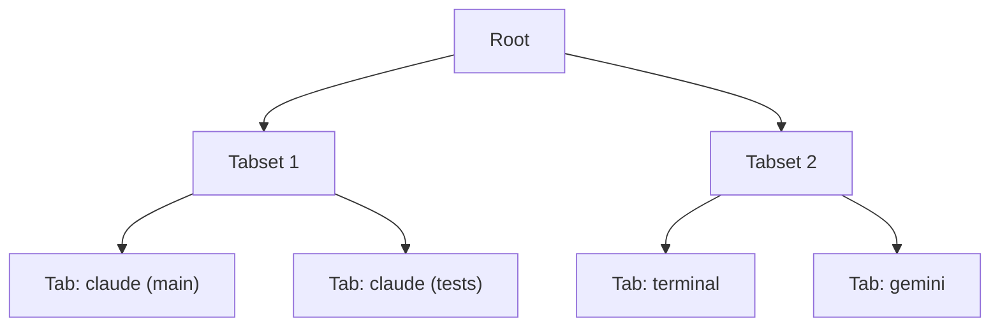

# Multi-Session

Forja lets you run as many concurrent sessions as you need within a single project window. Each session has its own PTY process, xterm.js instance, scrollback buffer, and independent state — switching tabs is instant with no process interruption.

## Tiling Layout

Sessions are organized using **FlexLayout**, a tiling tab manager that supports free-form drag-and-drop splitting. The layout is a tree of tabsets, each of which holds one or more tabs.

You can split any tabset horizontally or vertically by dragging a tab to an edge of the pane. The layout resizes dynamically and can be collapsed or maximized per tabset.

## Tab Management

### Keyboard Shortcuts

| Action | Shortcut |
|--------|----------|
| Close current tab | `Ctrl+W` |
| Switch to next tab | `Ctrl+Tab` |
| Switch to previous tab | `Ctrl+Shift+Tab` |
| Jump to tab 1–9 | `Ctrl+Shift+1` through `Ctrl+Shift+9` |

### Mouse Actions

| Action | How |
|--------|-----|
| Rename tab | Double-click the tab title |
| Reorder tabs | Drag within the same tabset |
| Move to new pane | Drag to a pane edge to split |
| Close tab | Click the × button on the tab |

### Context Menu

Right-click any tab to access additional actions:

- **Rename** — enter a custom label
- **Close** — close this session only
- **Close Others** — close all other tabs in the tabset
- **Move to New Tabset** — split the current pane and move the tab

## Session Persistence

Forja restores your session layout when you reopen a project. The following state is persisted to `~/.config/forja/config.json`:

| State | Persisted |
|-------|-----------|
| Tab names and order | Yes |
| Tiling layout (split ratios) | Yes |
| PTY processes | No — sessions relaunch on restore |
| Scrollback buffer | No — cleared on quit |
| Browser pane URL | Yes |

<Callout type="info">
  PTY processes are not preserved across restarts. When you reopen a project, Forja relaunches each session at the CLI's initial prompt. If you need to resume interrupted work, check the CLI's own session resumption features (e.g., `claude --resume`).
</Callout>

## Launching a New Session

Click the **+** button in any tabset header or use `Ctrl+Shift+N` to open the session launcher. Select a CLI from the list, choose an optional working directory override, and confirm to start the session immediately.
