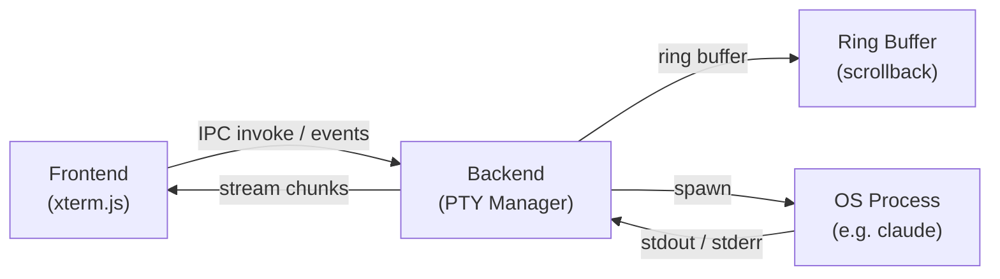

# Terminal

Forja uses the same terminal stack as VS Code: **xterm.js** for rendering and **node-pty** for process management. Every session runs in a real pseudo-terminal, which means the AI CLI receives a proper TTY, color codes work correctly, and interactive prompts behave as expected.

## Supported CLIs

| CLI | Package | Notes |
|-----|---------|-------|
| **Claude Code** | `@anthropic-ai/claude-code` | Best tested. Session telemetry supported. |
| **Gemini CLI** | `@google/gemini-cli` | Full PTY support |
| **Codex CLI** | `@openai/codex` | Full PTY support |
| **Cursor Agent** | `cursor` binary | Full PTY support |
| **Terminal** | `$SHELL` (bash, zsh, fish) | Plain shell — no AI CLI required |

Forja detects installed CLIs on startup using `which` (Unix) or `where.exe` (Windows). Only CLIs that are installed and available in `PATH` appear in the session launcher.

## PTY Architecture

The PTY Manager spawns the CLI process, attaches a ring buffer for scrollback, and streams output chunks back to the renderer via Electron IPC events. The renderer feeds chunks directly into xterm.js, which handles all VT sequence rendering.

## Split Panes

You can split the terminal area horizontally or vertically to run multiple sessions side by side.

| Action | Shortcut |
|--------|----------|
| Split vertically | `Ctrl+\` |
| Split horizontally | `Ctrl+Shift+\` |
| Split via drag | Drag a tab to an edge |

Each pane is an independent xterm.js instance with its own PTY process, scrollback buffer, and zoom level.

## Zoom

Each pane has its own independent font size that does not affect other panes.

| Action | Shortcut |
|--------|----------|
| Zoom in | `Ctrl++` |
| Zoom out | `Ctrl+-` |
| Reset zoom | `Ctrl+0` |

## Session State Indicators

A status badge in each tab header reflects the current state of the PTY process.

| State | Indicator | Description |
|-------|-----------|-------------|
| **Ready** | Solid dot | CLI is idle and waiting for input |
| **Processing** | Spinner | CLI is actively running a task |
| **Ended** | Faded dot | Process exited — session can be relaunched |

## Copy and Paste

- **Copy**: Select text and press `Ctrl+C` (or right-click -> Copy). Forja intercepts `Ctrl+C` only when text is selected; otherwise it sends the interrupt signal to the PTY.
- **Paste**: `Ctrl+V` pastes clipboard content directly into the PTY.

On macOS, `Cmd+C` and `Cmd+V` also work.

## Scrollback Buffer

Each terminal session maintains a configurable scrollback buffer (default: 5,000 lines). You can scroll through history with the mouse wheel or `Shift+PageUp` / `Shift+PageDown`. The buffer is preserved for the lifetime of the session but is not persisted to disk.

<Callout type="info">
  Forja does not modify how the AI CLI behaves. It is purely a PTY host — the CLI communicates with its own cloud API directly, and Forja never sees or stores API keys.
</Callout>
