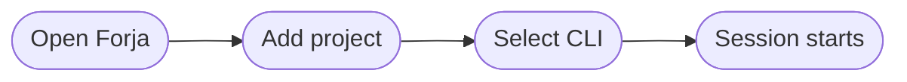
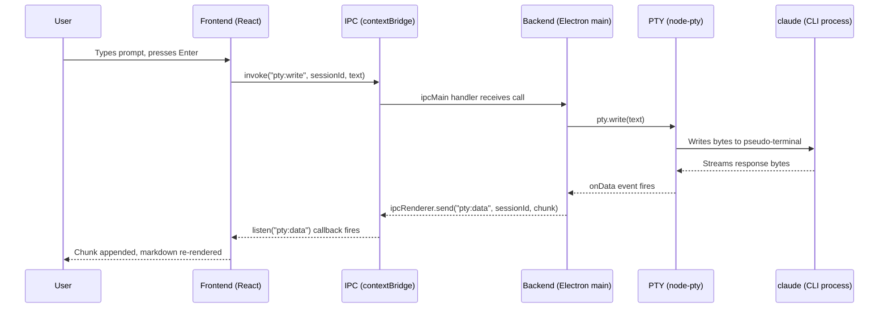

# First Session

## Overview

The flow from opening Forja to an active AI session takes four steps:

## Step 1 — Add a project

When you first open Forja you will see the welcome screen with no projects listed.

Click the **+** button in the sidebar (or press the keyboard shortcut shown in the tooltip) and choose a directory on your filesystem. Forja does not copy or move files — it just registers the path so it can open sessions there.

You can add as many projects as you like. They appear in the left sidebar grouped by workspace.

## Step 2 — Open the project

Click the project name in the sidebar to open the project home screen. Forja reads the directory and shows:

- A file tree with git status badges (M, A, D) on modified files.
- The current git branch in the header.
- An empty sessions area ready for your first session.

## Step 3 — Start a new session

Click the **New session** dropdown at the top of the sessions area and select the CLI you want to use. Forja will:

1. Spawn the CLI process in the project directory via a PTY.
2. Open a new session tab.
3. Show the CLI's startup output (model info, project context, etc.) as rendered markdown.

If the selected CLI is not installed or not found in `PATH`, Forja shows an error with a link to the installation docs for that CLI.

## Step 4 — Interact with the AI

Type your prompt in the input field at the bottom and press **Enter**. Forja streams the response back in real time:

- **Prose and lists** are rendered as HTML from markdown.
- **Code blocks** are syntax-highlighted using Shiki (Catppuccin Mocha theme by default).
- **Tool calls** (file reads, edits, shell commands) appear as collapsible blocks so you can track what the AI is doing without noise.

## Multiple sessions

You can run several sessions at the same time — for example, Claude Code in one tab and a plain terminal in another. Sessions are independent PTY processes; they do not share context unless the CLI itself supports it.

Split the view horizontally or vertically using the pane controls in the toolbar to keep sessions visible side by side.

## Behind the scenes

Here is what happens technically when you send a message:

The CLI process is never aware it is running inside Forja — it talks to its own cloud API directly. Forja just acts as a graphical PTY host.

## Next steps

<Cards>
  <Card
    title="Features"
    href="/docs/features/terminal"
    description="Explore the file tree, embedded browser, themes, command bar, and more."
  />
  <Card
    title="Configuration"
    href="/docs/configuration"
    description="Customize fonts, themes, keybindings, and session defaults."
  />
</Cards>
