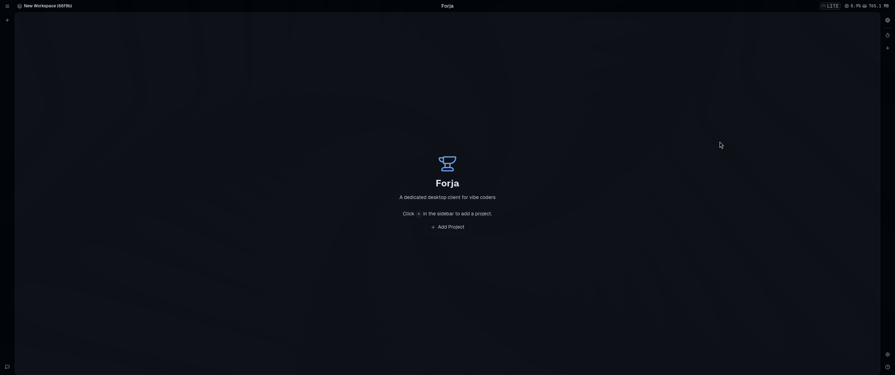
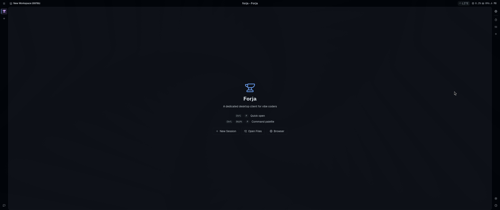
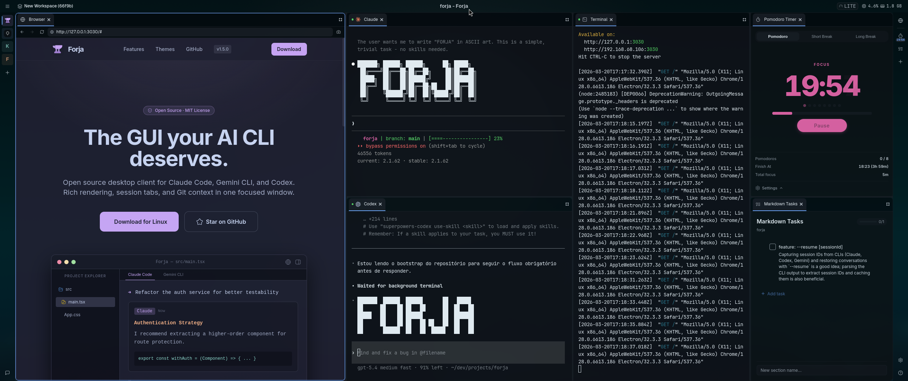
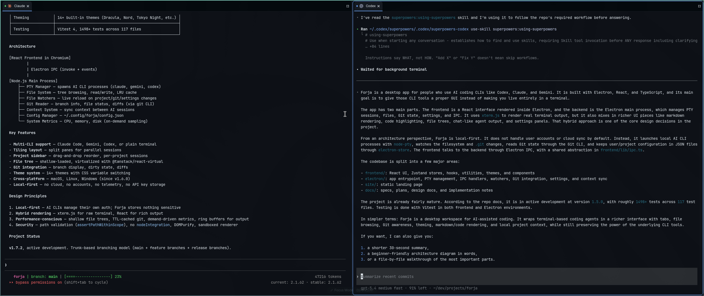
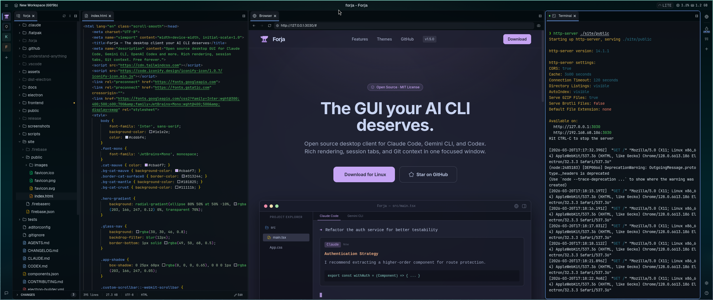
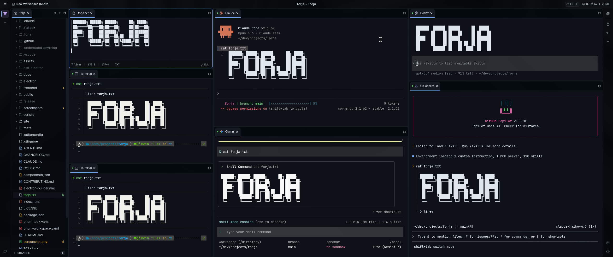
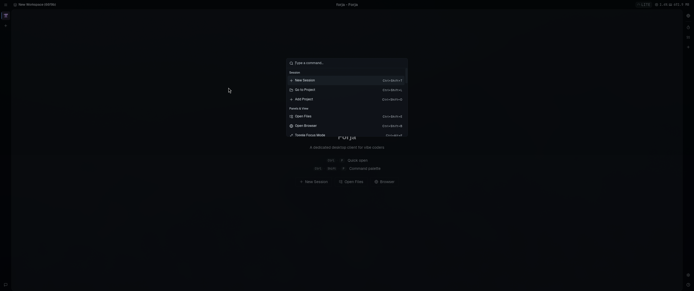
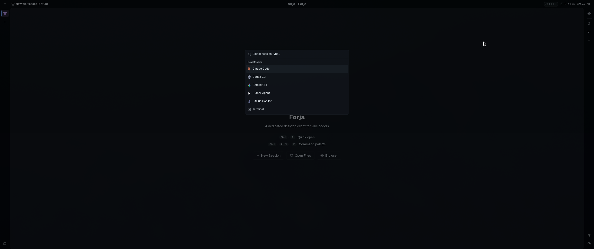

# Screenshots

Visual guide to Forja's core features and interface.

## 0. Workspaces with Projects

A fully loaded workspace showing multiple features working together. The left sidebar displays the **file tree** with directory structure and git status indicators. The center pane shows a **file preview** rendering a `CLAUDE.md` markdown file with syntax-highlighted code blocks. The top-right pane runs a **terminal session** displaying test results and repository structure. The bottom-right features a **Pomodoro timer** and a **Markdown Tasks** panel. The **status bar** at the bottom shows git branch info and system metrics. An **embedded browser** pane is also visible, displaying the project's GitHub repository page.

## 1. First Screen (Add Project)

The initial empty state when launching Forja for the first time. The screen displays the Forja logo and tagline ("A dedicated desktop client for vibe coders") with a clear call-to-action to add a project. Users can click the **+ button** in the sidebar or the **+ Add Project** button in the center to open a directory picker. The **custom titlebar** shows the workspace name on the left and system metrics (CPU usage, memory) on the right. The right-side toolbar provides quick access to settings, sessions, and the add project action.

## 2. Project Home Screen

The home screen after a project has been added to a workspace. The left sidebar now shows the project icon, and the center area displays useful **keyboard shortcut hints**: `Ctrl + P` for Quick Open (file navigation) and `Ctrl + Shift + P` for the Command Palette. Below the shortcuts, three quick action buttons are available: **New Session** (start a new AI CLI or terminal session), **Open Files** (browse the file tree), and **Browser** (open the embedded browser pane). This screen serves as the starting point for all project interactions.

## 3. Focus Workspace

A workspace in active use with multiple panes and sessions. The left pane shows an **embedded browser** displaying the Forja landing page. The center pane runs **two terminal sessions** in a vertical split: the top session shows Claude Code generating ASCII art, while the bottom session displays a background terminal task. The right side features a **terminal session** running test output alongside the **Pomodoro timer** and **Markdown Tasks** panel. The **tab bar** at the top of each pane group allows switching between sessions. This layout demonstrates the flexible **tiling pane system** with horizontal and vertical splits.

## 4. Fullscreen Focus Mode

Two terminal sessions running side by side in a clean, distraction-free layout. The left pane displays a **Claude Code session** with the `CLAUDE.md` file content rendered as formatted text, showing the project's architecture documentation. The right pane shows another **Claude Code session** in conversation mode, where the AI assistant is responding to a question about the project. This view highlights the **rich text rendering** capability: markdown content from the AI CLI is displayed with proper formatting, headers, bullet points, and code blocks rather than raw terminal output. The file tree sidebar is collapsed to maximize the terminal area.

## 5. Open Browser (Dev Mode)

A development workflow with the **embedded browser** open alongside code and terminal sessions. The left pane shows the **file tree** with the project's source files. The center pane displays the **embedded browser** with the Forja landing page loaded from a local development server, complete with a navigation toolbar (back, forward, reload, URL bar). The right pane runs a **Claude Code session** showing real-time development output. This layout demonstrates how developers can preview their web application directly within Forja while simultaneously interacting with AI coding assistants, eliminating the need to switch between windows.

## 6. Panes and Multi-Sessions

A complex multi-pane layout showcasing Forja's **tiling window manager**. Nine terminal panes are arranged in a 3x3 grid, each running independent sessions. Several panes show **Claude Code** sessions with ASCII art output, demonstrating concurrent AI interactions. Other panes display **different session types**: a plain terminal running shell commands, a session showing error output with colored diagnostics, and a session displaying the **CLI auto-detection** feature. The **project sidebar** on the left lists multiple projects with their directory structure. Each pane has its own **tab bar** allowing multiple sessions per pane. This view demonstrates the full flexibility of the split pane system for power users who need to monitor multiple processes simultaneously.

## 7. Command Bar

The **Command Palette** overlay activated via `Ctrl + Shift + P`. A searchable list of available commands appears in a centered modal, including **New Session**, **New Browser**, **Add Project**, **Open Files**, **Open Browser**, and **Toggle Pomodoro Timer**. Each command displays its corresponding keyboard shortcut on the right side (e.g., `Ctrl+Shift+T`, `Ctrl+Shift+B`). The search input at the top allows fuzzy filtering of commands by name. Below the palette, the home screen remains visible with its quick action buttons and the Forja tagline. This is the primary way to discover and execute actions without memorizing every shortcut.

## 8. Command for AI Sessions

The **New Session** selector triggered from the Command Palette or the **+ New Session** button. A modal displays all available AI CLI session types that Forja has auto-detected on the system: **Claude Code**, **Codex CLI**, **Gemini CLI**, **Cursor Agent**, **GitHub Copilot**, and a plain **Terminal**. Each option shows its icon for quick identification. The search input at the top allows filtering session types by name. Selecting an entry spawns a new PTY process for that CLI tool in the active pane. This view highlights Forja's **multi-CLI support**, letting developers choose their preferred AI coding assistant or open a standard terminal, all from a single unified launcher.
